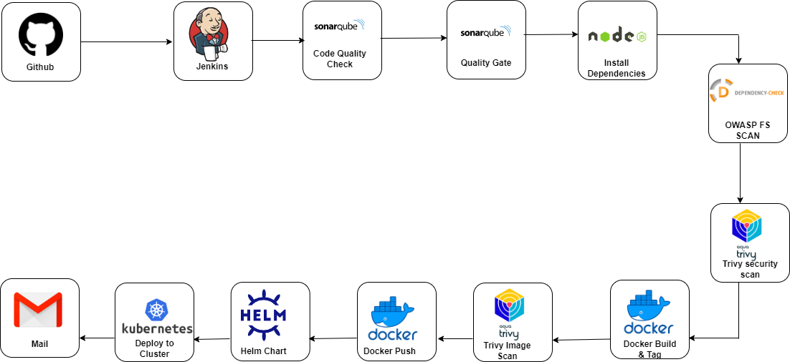

# DevSecOps: CI/CD pipeline to deploy a NodeJs Reddit Clone on a Kubernetes Cluster

#### CI/CD   `Jenkins`
#### Tools      `Nodejs npm, Aqua trivy, Sonarqube, OWASP Scan, Docker, Helm, Kubernetes`
#### Cloud Platform  : ` AWS `

- This application was not developed by me. It's available online for learning purposes. 
So I Dockerized the application, created a Helm Chart, CI/CD pipeline using Jenkins and also the Kubernetes cluster where the application will be deployed.

